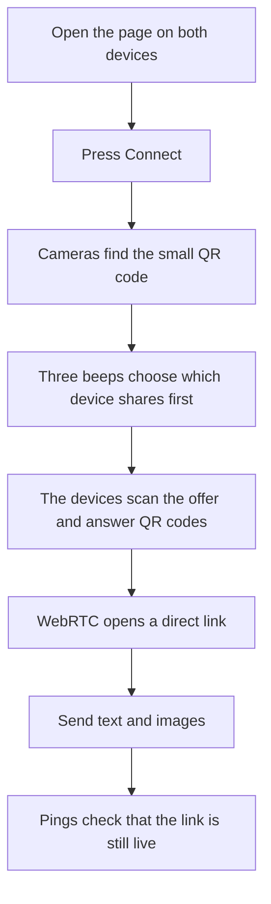

# NearChat Direct

NearChat Direct lets two nearby devices send text and images to each other.

It has no accounts. It does not use a chat server, STUN, or TURN.

## How it works

## Images

- Select up to 20 images at once.
- Images are made no larger than 1600 by 1600 pixels.
- WebP is used first. JPEG is the backup.
- Each sent image is kept under 2 MB.
- Location and camera details are removed.
- Images are sent one at a time in the order selected.

## Files

- `index.html` holds the page.
- `styles.css` holds the page style.
- `app.js` holds the chat and pairing code.
- `assets/` holds the QR and RaptorQ files.

## Hosting

The app can run on GitHub Pages. Camera and microphone access need HTTPS or localhost.
